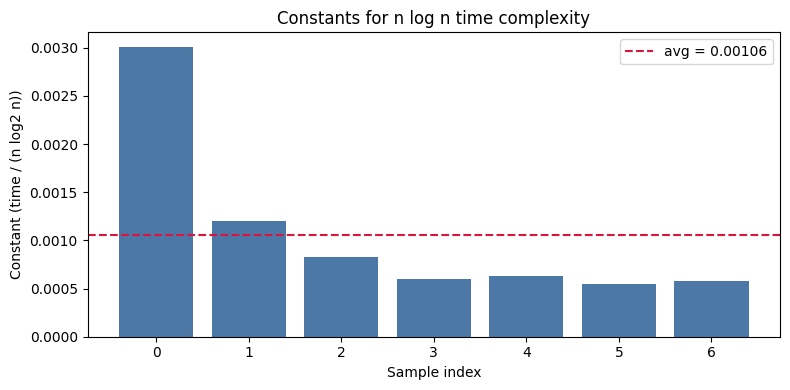
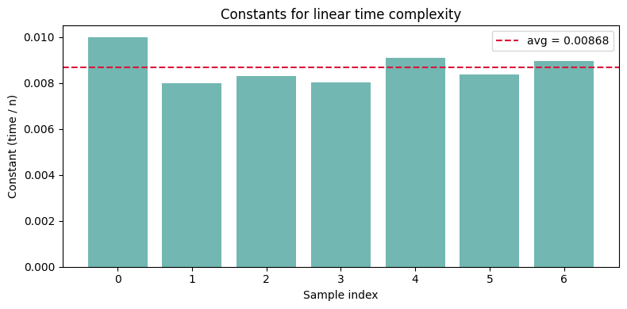
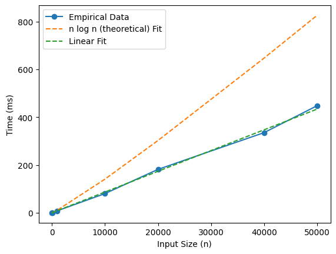
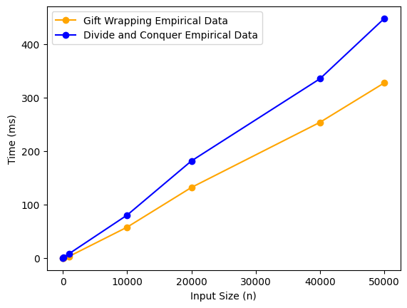
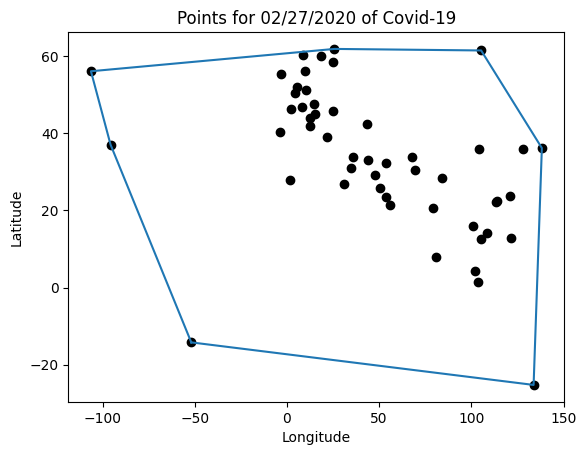
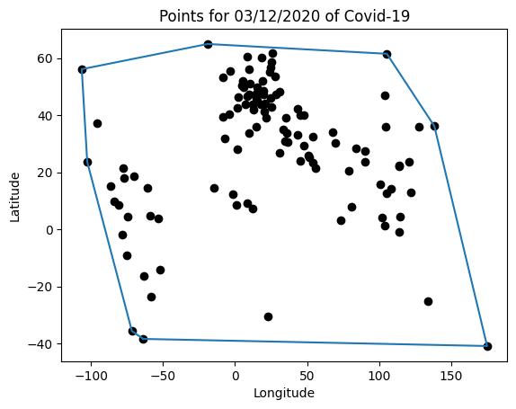
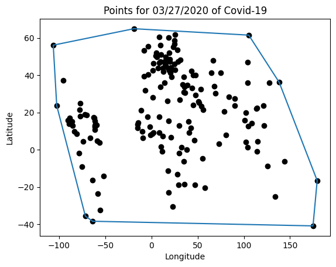

# Project Report - Convex Hull

## Baseline

### Design Discussion

With Thomas Esplin on 10/21/2025

My plan to implement this algorithm is to recursively call the convex hull function on smaller and smaller hulls, dividing the amount of work to be done in two each time. My base case for the function will be when the number of point is simply 1. This is because if there's only 1 point, it must be the hull.

To merge the hulls back together, I will simply find the upper and lower tangent. The points that make up the upper and lower tangents make up the hull. I will then continue the merging process until the whole hull is constructed. The pseudocode for doing this is quite straight forward. I will use tuples to represent points and may use the numpy to calculate the slopes of the various lines in a performative manner.

### Theoretical Analysis - Convex Hull Divide-and-Conquer

#### Time 

##### convex_hull_dvcq - **O(n log n)**

```py
def compute_hull_dvcq(points: list[tuple[float, float]]) -> list[tuple[float, float]]:
    """Return the subset of provided points that define the convex hull"""
    if len(points) <= 1:
        return points
    left_side, right_side = divide_points(points) # divides by 2. a and b are 2
    left_hull = compute_hull_dvcq(left_side)
    right_hull = compute_hull_dvcq(right_side)
    merged_hull = merge_hulls(left_hull, right_hull) # see function below
    return merged_hull
```

Here's the top level for the algorithm. We see that the algorithm divides the points by 2 each time. The important thing here is that 2 is therefore the branching factor a, and the reduction factor b. There are two recursive calls each function call. This is because each call the function divides it into two sub problems that are half the size. So in our recurrence relation a = 2, and b = 2. This also means that our time complexity will be determined by the time complexity of merging hulls, which represents the time complexity of work that we do on each node in combining the recurrence together. It is our d.

```py
def merge_hulls(left_hull: list[tuple[float, float]], 
                right_hull: list[tuple[float, float]]) -> list[tuple[float, float]]:
    left_hull_start_index = left_hull.index(max(left_hull, key=lambda point: point[0])) # O(n)
    right_hull_start_index = right_hull.index(min(right_hull, key=lambda point: point[0])) # O(n)
    left_hull_ordered_clockwise = left_hull[left_hull_start_index:] + left_hull[:left_hull_start_index] #O(n)
    right_hull_ordered_clockwise = right_hull[right_hull_start_index:] + right_hull[:right_hull_start_index] #O(n)
    left_hull_ordered_counterclockwise = get_counterclockwise(left_hull_ordered_clockwise) # O(n)
    right_hull_ordered_counterclockwise = get_counterclockwise(right_hull_ordered_clockwise) # O(n)
    left_upper, right_upper = get_tangent(left_hull_ordered_counterclockwise, 
                                          right_hull_ordered_clockwise, "upper") # O(n) See function below
    left_lower, right_lower = get_tangent(left_hull_ordered_clockwise, 
                                          right_hull_ordered_counterclockwise, "lower")
    final_hull = extract_new_hull(left_hull_ordered_clockwise, right_hull_ordered_clockwise, 
                                  left_upper, right_upper, left_lower, right_lower)
    return final_hull
```

The operations involving index and reordering based on clockwise and counterclockwise order are all linear operations because it could take at most n operations to find an element in an n sized array. The same goes for list concatenation because you would need to add n elements into a new array. This function is therefore at least O(n), but finding the upper and lower tangents will determine that. See below.

See my below analysis for why the get_tangent is O(n) and therefore makes this function O(n)

```py
def get_tangent(left_hull, right_hull, tangent_type: str):
    left_terminal, right_terminal = get_terminals(tangent_type) # O(1) Very trivial
    current_line = (left_hull[0], right_hull[0]) # O(1)
    current_slope = compute_slope(current_line[0], current_line[1]) # O(1)
    left_index, right_index = 0, 0 # O(1)
    changed = True
    while changed:   # O(n)
        changed = False
        current_line, current_slope, left_index, changed = \
            process_rotation(left_hull, current_line, current_slope,  #O(n)
                             left_index, changed, left_terminal, "left")
        current_line, current_slope, right_index, changed = \          
            process_rotation(right_hull, current_line, current_slope,  # O(n)
                             right_index, changed, right_terminal, "right")
    return current_line
```

The get_terminals function is so trivial that I wont analyze it. I simply added it to improve code quality to modularize the codebase. It simply returns the type of comparator function to be use as the terminal case in each hull tangent rotation. These are constant time operations, which means it's the loop that will determine this function's time complexity. See the function below.

The loop here will loop is isn't your traditional nested for loop. Because of the way that the loop advances both the left hull and the right hull together, we know that the left index can advance up to n / 2 times through the process rotation calls (depending on how thing shake out), and the right index can also advance up to n / 2 times. Which means that throughout the total course of the while loop, individual checks (through the process rotation function) will at worst case be made for n points. This gives that while loop a time complexity of O(n)

```py
def process_rotation(hull, current_line, current_slope, index, changed, terminal_case, hull_side: str):
    for i in range(index+1, len(hull)): # O(n)
        if hull_side == "left":
            new_line = (hull[i], current_line[1]) #O(1)
        else:
            new_line = (current_line[0], hull[i])
        new_slope = compute_slope(new_line[0], new_line[1]) #O(1)
        if terminal_case(new_slope, current_slope): #O(1)
            break
        current_line = new_line
        current_slope = new_slope
        index = i
        changed = True
    return current_line, current_slope, index, changed
```

This function is littered with O(1) operations. The only important thing is the range loop at the top. The issue here is that if the slope continues to improve towards the ideal, it could (in theory) loop through all of the points on the hull in question. That would be n / 2 points for a given hull.

Looking at the the overall time complexity, we see that the merge hulls function take O(n). The merge hulls time complexity correspond to the d value in our recurrence relation such that d = 1 so that we can get O(n^1) for merge hulls. We have a = 2, b = 2, and d = 1. T(n) = 2(n/2) + O(n^1). We have a / b^2 = 2 / 2^1 = 1. According to the Master Theorem, in that situation T(n) = n^d log n. So T(n) = n^1 log n = n log n. Our time complexity is **O(n log n)**


#### Space

##### compute_hull_dvcq - **O(n)**

```py
def compute_hull_dvcq(points: list[tuple[float, float]]) -> list[tuple[float, float]]: # O(n) array storing n points 
    """Return the subset of provided points that define the convex hull"""
    if len(points) <= 1:
        return points
    left_side, right_side = divide_points(points) # O(n)
    left_hull = compute_hull_dvcq(left_side) # O(n)
    right_hull = compute_hull_dvcq(right_side) # O(n)
    merged_hull = merge_hulls(left_hull, right_hull) # O(n)
    return merged_hull
```

In terms of data structure, we need to store n points, so even as we divide the hull in two, the space for the outer part of the function still scales linearly because you need n array elements to store n points.

```py
def merge_hulls(left_hull: list[tuple[float, float]], 
                right_hull: list[tuple[float, float]]) -> list[tuple[float, float]]: # O(n)
    left_hull_start_index = left_hull.index(max(left_hull, key=lambda point: point[0])) # O(1)
    right_hull_start_index = right_hull.index(min(right_hull, key=lambda point: point[0])) # O(1)
    left_hull_ordered_clockwise = left_hull[left_hull_start_index:] + left_hull[:left_hull_start_index] # O(n)
    right_hull_ordered_clockwise = right_hull[right_hull_start_index:] + right_hull[:right_hull_start_index] # O(n)
    left_hull_ordered_counterclockwise = get_counterclockwise(left_hull_ordered_clockwise) # O(n)
    right_hull_ordered_counterclockwise = get_counterclockwise(right_hull_ordered_clockwise) # O(n)
    left_upper, right_upper = get_tangent(left_hull_ordered_counterclockwise, # O(1)
                                          right_hull_ordered_clockwise, "upper")
    left_lower, right_lower = get_tangent(left_hull_ordered_clockwise, 
                                          right_hull_ordered_counterclockwise, "lower") # O(1)
    final_hull = extract_new_hull(left_hull_ordered_clockwise, right_hull_ordered_clockwise, 
                                  left_upper, right_upper, left_lower, right_lower) # O(n)
    return final_hull
```

When we merge hulls, all we are doing is computing indexes (which take up constant space) and computing different reorderings of hulls, which take up linear space too. The storage of these indexes are simply constant space. There isn't a data structure here that grows faster that O(n)

```py
def get_tangent(left_hull, right_hull, tangent_type: str): # O(n)
    left_terminal, right_terminal = get_terminals(tangent_type)
    current_line = (left_hull[0], right_hull[0]) #                This is full of O(1) space variables
    current_slope = compute_slope(current_line[0], current_line[1])
    left_index, right_index = 0, 0
    changed = True
    while changed:
        changed = False
        current_line, current_slope, left_index, changed = \
            process_rotation(left_hull, current_line, current_slope, 
                             left_index, changed, left_terminal, "left")
        current_line, current_slope, right_index, changed = \
            process_rotation(right_hull, current_line, current_slope, 
                             right_index, changed, right_terminal, "right")
    return current_line
```

This function is even more trivial because its full of O(1) space variables such as the left index, right index, and the changed boolean. Sure, the hulls themselves are O(n) space but they were already accounted for in previous functions.

From a holistic perspective, our array is the only relevant data structure here. It stores a n points (sometime n/2). At times we duplicate it to perform reordering operations. All in all, in a single instance, it only grows to store n items and is therefore linear.

However, because this algorithm is recursive, we must consider the call stack. The call stack is at most the log2(length of hull set) deep. Because we create new arrays each time, the call stack become significant. The size of the array decreases by half each time. So, an additional log2(length of hull set) worth of array are stored and impact the space complexity. Our analysis can be informed by the fact that the sum of the sizes of the array approach n as the call stack continues. This means that the recursive spacial sum will be approximately n. So we have n for the initial space and n for the recursive space. O(2n) = **O(n)**

## Core

### Design Discussion

With Thomas Esplin on 10/21/2025

For my design, my goal is to ensure that I am able to path both the baseline and core tests. I anticipate that the test with the shared tangent point will be a difficult case to handle. I will make sure that this case does not break my code by making sure that I adequately separate the point from each constituent hull that I merge.

There could be further problems when using different types of distributions to create the hull problem. The key to solving this is ensuring that my algorithm works independently of any distributional suppositions that I may have about the data.

They all passed on the first try.

### Empirical Data - Convex Hull Divide-and-Conquer

| N     | time (ms) |
|-------|-----------|
| 10    |     0.1   |
| 100   |    0.8    |
| 1000  |    8.3    |
| 10000 |    80.3   |
| 20000 |    181.6  |
| 40000 |    335.4  |
| 50000 |     448.1 |

### Comparison of Theoretical and Empirical Results

- Theoretical order of growth: **O(n log n)**
- Empirical order of growth (if different from theoretical): **O(n)**

- Theoretical constant: 0.00106
- Empirical constant: 0.00868



As you can see, the constant distribution for my theoretical order of O(n log n) is far from uniform



On the other hand, the linear constant distribution is completely uniform. It's a near perfect match



Furthermore, we see here that linear time complexity O(n) is a near perfect match in this situation. This is not what I was expecting and is completely different from my theoretical of O(n log n).

In reconciling this, I have come up with a few reasons as to why the theoretical was so off. First off all, I think that it could do with an overestimation of the time complexity of the get_tangent function. In that function, I say that its theoretically possible for the algorithm to search through a total of n points to find a tangent!

While this is true in theory, in practice (when I have personally done the problem myself), it generally never takes n operations to find a tangent line. I think that this worse case scenario is very unrealistic under these conditions. In reality, it seems that the algorithm was able to compute the tangent line in approximately a constant empirical time complexity.

However, it still must not have been truly constant because of all the array duplications, searching, and index operations that guarantee linear time. Part of the issue here is that the master theorem guarantees this big O as the input size approaches infinity. Perhaps we would have seen it reflected more if we would have done more testing.

All in all, I think that the empirical of **O(n)** doesn't match my theoretical of O(n log n) primarily because of my worst case scenario regarding the tangent line computation.

## Stretch 1

### Design Discussion

With Thomas Esplin on 10/21/2025

I will use the Jarvis's March gift wrapping algorithm. Instead of doing a divide and conquer that recursively split the super hull down the middle, it starts with the left most point (which is guaranteed to be on the hull) and finds the next hull point by finding the point that makes the smallest counterclockwise angle when compared to the previous point.

The idea is to continue doing this and wrap around until you arrive at the original point. This isn't as bad as a brute force algorithm but it could still technically require searching n^2 of the points. I don't expect the performance to be as good.

### Chosen Convex Hull Implementation Description

With the gift wrapping algorithm, it works by starting with a single point that is guaranteed to be on the hull (in this case the leftmost point). After that, it iterates through all the other points in the hull and finds the point that is the most counterclockwise to the point in question. The algorithm uses the cross product to compute this. The idea here is to then select the point adjacent to the previous point that must be on the whole. And the point that is the most mathematically counterclockwise to the point is guaranteed to be on the hull.

It then continues the loop, selecting more and more points that make up the convex hull. The loops then terminates when you have wrapped all the way around to the beginning. The obvious downside here is that you technically have to iterate through all the points for a given candidate before you can move on in the loop to compute another point on the hull.

### Empirical Data

| N     | time (ms) |
|-------|-----------|
| 10    |    0.0    |
| 100   |    0.3    |
| 1000  |    3.2    |
| 10000 |    57.7   |
| 20000 |     132   |
| 40000 |   253.9   |
| 50000 |    327.6  |

### Comparison of Chosen Algorithm with Divide-and-Conquer Convex Hull

#### Algorithmic Differences

The main algorithmic differences between the divide and conquer algorithm and the gift wrapping algorithm are that the divide and conquer algorithm effectively guarantees a big O upper bound of n log n (see my theoretical analysis from baseline). 

However, because the gift wrapping algorithm requires a for loop across all the points for each point, it effectively gives you a worst case scenario of O(n^2) if all n points in the distribution are on the hull. This is because that outer while loop runs as many times as there are points on the hull. This would also mean that it could perform really well for very dense point distributions where less points are on the hull.

#### Performance Differences



As you can see here, both algorithms largely had the same performance. The minute difference between them doesn't seem like enough to actually be considered significant. They certainly don't differ from each other by an order or magnitude. However, even with that, it is surprised to me that the gift wrap algorithm performed better (even though by just a small margin) than the dive and conquer algorithm.

I think that the difference and skew exist because the performance of the gift wrap algorithm is highly dependent on the number of points that make up the hull (for reasons explained previously with the while loop). This would also explain why as the sample size increased, the gift wrap algorithm tended to do comparatively better than the divide and conquer. This is because with a higher sample size, more of the points are likely to be within the hull as opposed to being a part of it. This likely indicates that the gift wrap algorithm should be used for large, dense datasets, and the divide and conquer should be used for less dense datasets.

## Stretch 2

### Design Experience

With Thomas Esplin on 10/21/2025

I will simply use the covid-19 dataset provided to test the algorithm. I suspect that the insights will be quite interesting. It could give me an idea as to the overall size of the hull. In this case, I imagine that it would indicate how the
size and complexity of the hull increased (or decreased over time).

This would be very useful because it could provide insight into how viruses like covid-19 spread. I will parse the csv file by using the built in .split() function on python strings. I will then analyze the data using the longitude and latitude and data points.

### Analysis

I used the provided covid-19 dataset to run the convex hull algorithm. This has vast implications in the filed of immunology and viral spread. If we can better understand how a virus spreads and infects various populations, we will be much better suited to respond to similar crises in the future.



As you can see in the first time series The points appear to be substantially concentrated around the top right of the world. The convex hull gives an idea as to how far the virus has actually spread across the world. Essentially, the idea is that the hull gives us the boundary of the virus.



This is quite a different result on the second time series. However, the convex hull remain largely the same (with a single exception). The hull has grown slightly more complex, but its too little a change to really be considered significant.



This third time series hull is similar to the other two. I'm sure that if the data were a little more comprehensive and included more than just a month, we'd see the hull expand a lot more. Regardless of that, we are seeing additional cases stack up in the bottom left corner of the world. Having the convex hull as a boundary here helps because it tells us the farthest boundary that the virus has spread to.

This goes to show that a virus can spread to its maximum capacity (in terms of geo-spatial area) very quickly -- even without completely saturating the center of its claims. We saw in later time series that the center of the viral claims began to saturated with more claims, but that was after the virus had already spread to several countries! It goes to show the importance of ensuring that a virus stays isolated in a single location to prevent further viral saturation.

## Project Review

*Fill me in*

